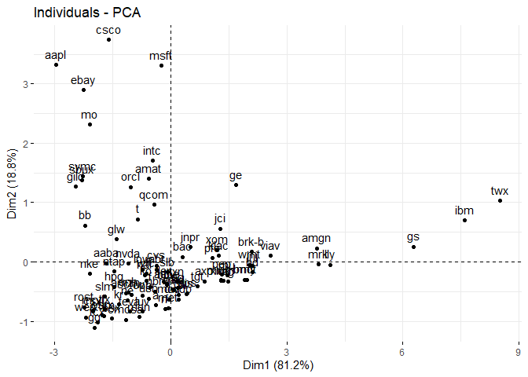
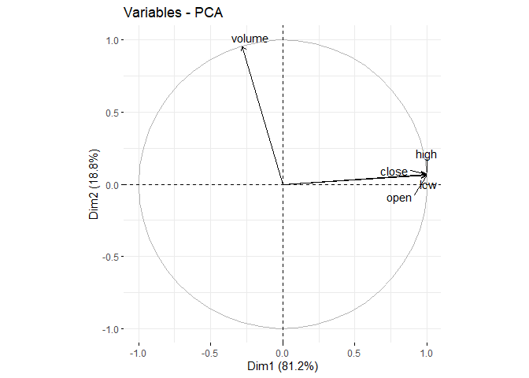
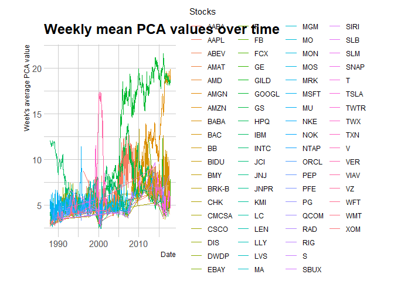
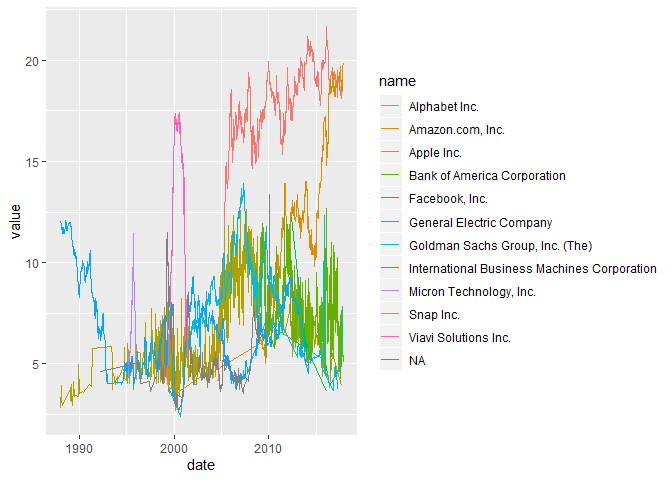

So for this project, we’re investigating the use of Principle Component
Analysis, PCA, and it’s uses in making a portfolio.

Why? To reduce the risk of a portfolio. Reducing the number of stocks in
the porfolio helps to reduce the covariance between stocks, which also
reduces the correlations between stocks. This helps to reduce the
overall risk of the portfolio.

What is PCA?
------------

Using PCA on our data
=====================

Data
----

There are 1004084 observations in our dataset. They contain all stocks
with a median daily volume of more than 3,350,000. The data is from Jan
1, 1988 until Nov 10, 2017. There are 239 stocks in the portfolio.

    glimpse(stocks)

    ## Observations: 1,004,084
    ## Variables: 8
    ## $ date     <date> 1999-11-18, 1999-11-19, 1999-11-22, 1999-11-23, 1999...
    ## $ open     <dbl> 30.713, 28.986, 27.886, 28.688, 27.083, 27.594, 27.67...
    ## $ high     <dbl> 33.754, 29.027, 29.702, 29.446, 28.309, 28.012, 28.65...
    ## $ low      <dbl> 27.002, 26.872, 27.044, 27.002, 27.002, 27.509, 27.38...
    ## $ close    <dbl> 29.702, 27.257, 29.702, 27.002, 27.717, 27.807, 28.43...
    ## $ volume   <dbl> 66277506, 16142920, 6970266, 6332082, 5132147, 183263...
    ## $ open_int <dbl> 0, 0, 0, 0, 0, 0, 0, 0, 0, 0, 0, 0, 0, 0, 0, 0, 0, 0,...
    ## $ stock    <fct> a.us, a.us, a.us, a.us, a.us, a.us, a.us, a.us, a.us,...

    summary(stocks) 

    ##       date                 open                high          
    ##  Min.   :1988-01-04   Min.   :   0.0384   Min.   :   0.0579  
    ##  1st Qu.:2001-03-08   1st Qu.:   7.7291   1st Qu.:   7.8512  
    ##  Median :2008-07-09   Median :  16.9610   Median :  17.2130  
    ##  Mean   :2006-11-02   Mean   :  26.5654   Mean   :  26.8993  
    ##  3rd Qu.:2013-06-21   3rd Qu.:  32.5020   3rd Qu.:  32.9190  
    ##  Max.   :2017-11-10   Max.   :1126.1000   Max.   :1135.5400  
    ##                                                              
    ##       low               close               volume             open_int
    ##  Min.   :   0.000   Min.   :   0.0579   Min.   :0.000e+00   Min.   :0  
    ##  1st Qu.:   7.601   1st Qu.:   7.7292   1st Qu.:3.714e+06   1st Qu.:0  
    ##  Median :  16.698   Median :  16.9590   Median :6.762e+06   Median :0  
    ##  Mean   :  26.216   Mean   :  26.5635   Mean   :1.331e+07   Mean   :0  
    ##  3rd Qu.:  32.073   3rd Qu.:  32.5000   3rd Qu.:1.323e+07   3rd Qu.:0  
    ##  Max.   :1124.060   Max.   :1132.8800   Max.   :2.424e+09   Max.   :0  
    ##                                                                        
    ##      stock       
    ##  t.us   :  7528  
    ##  abt.us :  7527  
    ##  adbe.us:  7527  
    ##  amd.us :  7527  
    ##  axp.us :  7527  
    ##  bby.us :  7527  
    ##  (Other):958921

PCA
---

PCA assumes that the data is in the form of a matrix, and it requires
there is a single stock per row. Since our data is 30 years of stock
prices with 239 stocks, we chose to perform PCA on every day and then
aggregate the results of the PCA rather than aggregating the data and
then performing PCA.

When applied to the entire dataset, it is applied to each of the 7528
days in the dataset.

Let’s look at one of the days, 2001-06-21:

    df_models$pca_model[[400]] %>% 
      fviz_contrib(choice = "ind", axes = 1:5)

    df_models$pca_model[[400]] %>% 
      get_pca_var() %>% 
      magrittr::use_series("cor") %>% 
      knitr::kable()

<table>
<thead>
<tr class="header">
<th></th>
<th style="text-align: right;">Dim.1</th>
<th style="text-align: right;">Dim.2</th>
<th style="text-align: right;">Dim.3</th>
<th style="text-align: right;">Dim.4</th>
<th style="text-align: right;">Dim.5</th>
</tr>
</thead>
<tbody>
<tr class="odd">
<td>open</td>
<td style="text-align: right;">0.9976061</td>
<td style="text-align: right;">0.0645933</td>
<td style="text-align: right;">0.0224569</td>
<td style="text-align: right;">-0.0095027</td>
<td style="text-align: right;">0.0038894</td>
</tr>
<tr class="even">
<td>high</td>
<td style="text-align: right;">0.9973491</td>
<td style="text-align: right;">0.0702096</td>
<td style="text-align: right;">-0.0156850</td>
<td style="text-align: right;">-0.0094283</td>
<td style="text-align: right;">-0.0055200</td>
</tr>
<tr class="odd">
<td>low</td>
<td style="text-align: right;">0.9975985</td>
<td style="text-align: right;">0.0661615</td>
<td style="text-align: right;">0.0155092</td>
<td style="text-align: right;">0.0128894</td>
<td style="text-align: right;">-0.0036446</td>
</tr>
<tr class="even">
<td>close</td>
<td style="text-align: right;">0.9972998</td>
<td style="text-align: right;">0.0695271</td>
<td style="text-align: right;">-0.0222417</td>
<td style="text-align: right;">0.0060421</td>
<td style="text-align: right;">0.0052785</td>
</tr>
<tr class="odd">
<td>volume</td>
<td style="text-align: right;">-0.2811439</td>
<td style="text-align: right;">0.9596656</td>
<td style="text-align: right;">0.0001781</td>
<td style="text-align: right;">0.0000030</td>
<td style="text-align: right;">0.0000109</td>
</tr>
</tbody>
</table>

    df_models$pca_model[[400]] %>%
      fviz_screeplot()

    # df_models$pca_model[[400]] %>% Further inquiry needed
    #   fviz_cos2("ind")

    df_models$pca_model[[400]] %>%
      fviz_pca_ind()

    df_models$pca_model[[400]] %>%
      fviz_pca_var()

Below, are the top 10 companies that are most representative of the
companies over those 7528 days.

    # Each stock with a value everyday 
    portfolio_pre <- df_models %>% 
      select(-pca_model) %>% 
      unnest(c(data, rankings)) %>% 
      select(-name) %>% 
      arrange(desc(value))

    portfolio_pre %>% 
      group_by(stock) %>% 
      summarize(mean_value = mean(value)) %>% 
      arrange(desc(mean_value)) %>% 
      head(10) %>% 
      left_join(tickers, by = c("stock" = "symbol")) %>% 
      select(name, mean_value) %>% 
      knitr::kable()

<table>
<thead>
<tr class="header">
<th style="text-align: left;">name</th>
<th style="text-align: right;">mean_value</th>
</tr>
</thead>
<tbody>
<tr class="odd">
<td style="text-align: left;">Alphabet Inc.</td>
<td style="text-align: right;">17.476354</td>
</tr>
<tr class="even">
<td style="text-align: left;">Goldman Sachs Group, Inc. (The)</td>
<td style="text-align: right;">6.798139</td>
</tr>
<tr class="odd">
<td style="text-align: left;">Amazon.com, Inc.</td>
<td style="text-align: right;">6.552126</td>
</tr>
<tr class="even">
<td style="text-align: left;">International Business Machines Corporation</td>
<td style="text-align: right;">5.967071</td>
</tr>
<tr class="odd">
<td style="text-align: left;">Apple Inc.</td>
<td style="text-align: right;">4.796797</td>
</tr>
<tr class="even">
<td style="text-align: left;">Tesla, Inc.</td>
<td style="text-align: right;">3.724188</td>
</tr>
<tr class="odd">
<td style="text-align: left;">NA</td>
<td style="text-align: right;">3.627641</td>
</tr>
<tr class="even">
<td style="text-align: left;">Baidu, Inc.</td>
<td style="text-align: right;">3.587910</td>
</tr>
<tr class="odd">
<td style="text-align: left;">Bank of America Corporation</td>
<td style="text-align: right;">3.268231</td>
</tr>
<tr class="even">
<td style="text-align: left;">Microsoft Corporation</td>
<td style="text-align: right;">3.130865</td>
</tr>
</tbody>
</table>

There are 73 different stocks that have appeared among each week’s top 5
stocks, between 1988-01-04 and 2017-11-10. Below are the are the PCA
values over time for each of these stocks.

    portfolio_pre %>% 
      arrange(date) %>% 
      mutate(date = floor_date(date, unit = "weeks")) %>%
      group_by(date, stock) %>% 
      summarize(value = mean(value)) %>% 
      ungroup() %>% 
      arrange(desc(value)) %>% 
      arrange(date) %>% 
      group_by(date) %>% 
      mutate(rownum = row_number(date)) %>% 
      ungroup() %>% 
      filter(rownum <= 10) %>% # Change this number to get the top X stocks on each day
      left_join(tickers, by = c("stock" = "symbol")) %>% 
      select(date, everything()) %>% 
      filter(rownum <= 5) %>% #distinct(stock) %>%  
      ggplot(aes(date, value)) + 
      geom_line(aes(color = stock))# + theme(legend.position = "none")

    portfolio_pre %>% 
      arrange(date) %>% 
      mutate(date = floor_date(date, unit = "weeks")) %>%
      group_by(date, stock) %>% 
      summarize(value = mean(value)) %>% 
      ungroup() %>% 
      arrange(desc(value)) %>% 
      arrange(date) %>% 
      group_by(date) %>% 
      mutate(rownum = row_number(date)) %>% 
      ungroup() %>% 
      filter(rownum <= 10) %>% # Change this number to get the top X stocks on each day
      left_join(tickers, by = c("stock" = "symbol")) %>% 
      select(date, everything()) %>% 
      filter(rownum <= 5) %>% #distinct(stock) %>%  
      group_by(stock) %>% 
      mutate(max_value = max(value)) %>% 
      ungroup() %>% 
      filter(max_value >= 10) %>% 
      ggplot(aes(date, value)) + 
      geom_line(aes(color = name))# + theme(legend.position = "none")

