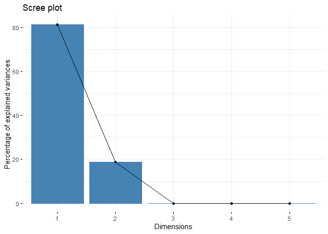

Data
----

There are 1004084 observations in the dataset. They contain all stocks
with a median daily volume of more than 3,350,000. The data is from Jan
1, 1988 until Nov 10, 2017. There are 239 stocks in the portfolio.

    glimpse(stocks)

    ## Observations: 1,004,084
    ## Variables: 8
    ## $ date     <date> 1999-11-18, 1999-11-19, 1999-11-22, 1999-11-23, 1999...
    ## $ open     <dbl> 30.713, 28.986, 27.886, 28.688, 27.083, 27.594, 27.67...
    ## $ high     <dbl> 33.754, 29.027, 29.702, 29.446, 28.309, 28.012, 28.65...
    ## $ low      <dbl> 27.002, 26.872, 27.044, 27.002, 27.002, 27.509, 27.38...
    ## $ close    <dbl> 29.702, 27.257, 29.702, 27.002, 27.717, 27.807, 28.43...
    ## $ volume   <dbl> 66277506, 16142920, 6970266, 6332082, 5132147, 183263...
    ## $ open_int <dbl> 0, 0, 0, 0, 0, 0, 0, 0, 0, 0, 0, 0, 0, 0, 0, 0, 0, 0,...
    ## $ stock    <fct> a.us, a.us, a.us, a.us, a.us, a.us, a.us, a.us, a.us,...

    summary(stocks)

    ##       date                 open                high          
    ##  Min.   :1988-01-04   Min.   :   0.0384   Min.   :   0.0579  
    ##  1st Qu.:2001-03-08   1st Qu.:   7.7291   1st Qu.:   7.8512  
    ##  Median :2008-07-09   Median :  16.9610   Median :  17.2130  
    ##  Mean   :2006-11-02   Mean   :  26.5654   Mean   :  26.8993  
    ##  3rd Qu.:2013-06-21   3rd Qu.:  32.5020   3rd Qu.:  32.9190  
    ##  Max.   :2017-11-10   Max.   :1126.1000   Max.   :1135.5400  
    ##                                                              
    ##       low               close               volume             open_int
    ##  Min.   :   0.000   Min.   :   0.0579   Min.   :0.000e+00   Min.   :0  
    ##  1st Qu.:   7.601   1st Qu.:   7.7292   1st Qu.:3.714e+06   1st Qu.:0  
    ##  Median :  16.698   Median :  16.9590   Median :6.762e+06   Median :0  
    ##  Mean   :  26.216   Mean   :  26.5635   Mean   :1.331e+07   Mean   :0  
    ##  3rd Qu.:  32.073   3rd Qu.:  32.5000   3rd Qu.:1.323e+07   3rd Qu.:0  
    ##  Max.   :1124.060   Max.   :1132.8800   Max.   :2.424e+09   Max.   :0  
    ##                                                                        
    ##      stock       
    ##  t.us   :  7528  
    ##  abt.us :  7527  
    ##  adbe.us:  7527  
    ##  amd.us :  7527  
    ##  axp.us :  7527  
    ##  bby.us :  7527  
    ##  (Other):958921

Model
-----

    pca_stocks <- stocks %>% 
      filter(date == ymd("2017-03-02")) %>% 
      select(-date) %>% 
      column_to_rownames(var = "stock") %>% 
      PCA() 

    pca_stocks %>% summary

    ## 
    ## Call:
    ## PCA(X = .) 
    ## 
    ## 
    ## Eigenvalues
    ##                        Dim.1   Dim.2   Dim.3   Dim.4   Dim.5   Dim.6
    ## Variance               4.014   0.986   0.000   0.000   0.000   0.000
    ## % of var.             80.289  19.710   0.001   0.000   0.000   0.000
    ## Cumulative % of var.  80.289  99.999 100.000 100.000 100.000 100.000
    ## 
    ## Individuals (the 10 first)
    ##              Dist    Dim.1    ctr   cos2    Dim.2    ctr   cos2    Dim.3
    ## a.us     |  0.451 |  0.028  0.000  0.004 | -0.450  0.088  0.996 | -0.002
    ## aaba.us  |  0.247 | -0.116  0.001  0.221 | -0.218  0.021  0.778 |  0.003
    ## aal.us   |  0.195 | -0.121  0.002  0.387 | -0.153  0.010  0.612 | -0.006
    ## aapl.us  |  2.229 |  1.957  0.408  0.771 |  1.067  0.493  0.229 |  0.000
    ## abbv.us  |  0.244 |  0.238  0.006  0.952 | -0.053  0.001  0.047 |  0.006
    ## abev.us  |  1.419 | -1.142  0.139  0.647 |  0.843  0.308  0.353 |  0.001
    ## abt.us   |  0.185 | -0.163  0.003  0.772 |  0.088  0.003  0.227 |  0.005
    ## adbe.us  |  1.665 |  1.630  0.283  0.959 | -0.336  0.049  0.041 |  0.006
    ## aeo.us   |  0.878 | -0.877  0.082  0.999 |  0.028  0.000  0.001 |  0.005
    ## agnc.us  |  0.900 | -0.750  0.060  0.695 | -0.497  0.107  0.305 |  0.003
    ##             ctr   cos2  
    ## a.us      0.070  0.000 |
    ## aaba.us   0.097  0.000 |
    ## aal.us    0.518  0.001 |
    ## aapl.us   0.000  0.000 |
    ## abbv.us   0.525  0.001 |
    ## abev.us   0.014  0.000 |
    ## abt.us    0.321  0.001 |
    ## adbe.us   0.597  0.000 |
    ## aeo.us    0.346  0.000 |
    ## agnc.us   0.093  0.000 |
    ## 
    ## Variables
    ##             Dim.1    ctr   cos2    Dim.2    ctr   cos2    Dim.3    ctr
    ## open     |  0.999 24.881  0.999 |  0.034  0.118  0.001 | -0.003 38.737
    ## high     |  0.999 24.879  0.999 |  0.035  0.126  0.001 | -0.002 11.208
    ## low      |  0.999 24.881  0.999 |  0.034  0.116  0.001 |  0.002 11.086
    ## close    |  0.999 24.881  0.999 |  0.034  0.119  0.001 |  0.003 38.969
    ## volume   | -0.139  0.478  0.019 |  0.990 99.522  0.981 |  0.000  0.000
    ## open_int |  0.000  0.000    NaN |  0.000  0.000    NaN |  0.000  0.000
    ##            cos2  
    ## open      0.000 |
    ## high      0.000 |
    ## low       0.000 |
    ## close     0.000 |
    ## volume    0.000 |
    ## open_int    NaN |

    pca_stocks

    ## **Results for the Principal Component Analysis (PCA)**
    ## The analysis was performed on 234 individuals, described by 6 variables
    ## *The results are available in the following objects:
    ## 
    ##    name               description                          
    ## 1  "$eig"             "eigenvalues"                        
    ## 2  "$var"             "results for the variables"          
    ## 3  "$var$coord"       "coord. for the variables"           
    ## 4  "$var$cor"         "correlations variables - dimensions"
    ## 5  "$var$cos2"        "cos2 for the variables"             
    ## 6  "$var$contrib"     "contributions of the variables"     
    ## 7  "$ind"             "results for the individuals"        
    ## 8  "$ind$coord"       "coord. for the individuals"         
    ## 9  "$ind$cos2"        "cos2 for the individuals"           
    ## 10 "$ind$contrib"     "contributions of the individuals"   
    ## 11 "$call"            "summary statistics"                 
    ## 12 "$call$centre"     "mean of the variables"              
    ## 13 "$call$ecart.type" "standard error of the variables"    
    ## 14 "$call$row.w"      "weights for the individuals"        
    ## 15 "$call$col.w"      "weights for the variables"

    stock_names <- stocks %>% 
      filter(date == ymd("2017-03-02")) %>% 
      distinct(stock) %>% 
      mutate(stock = as.character(stock)) %>% 
      pull(stock)

    #pca_stocks$ind
    as_tibble(pca_stocks$ind) %>% 
      mutate(stock = stock_names) %>% 
      select(stock, everything()) %>% 
      janitor::clean_names() %>% 
      arrange(desc(dist)) %>% 
      select(stock, dist) 

    ## # A tibble: 234 x 2
    ##    stock     dist
    ##    <chr>    <dbl>
    ##  1 googl.us 18.8 
    ##  2 amzn.us  18.8 
    ##  3 snap.us  11.9 
    ##  4 amd.us    5.28
    ##  5 bac.us    5.23
    ##  6 gs.us     4.69
    ##  7 tsla.us   4.68
    ##  8 brk-b.us  2.95
    ##  9 ibm.us    2.94
    ## 10 amgn.us   2.93
    ## # ... with 224 more rows

Testing ancova
