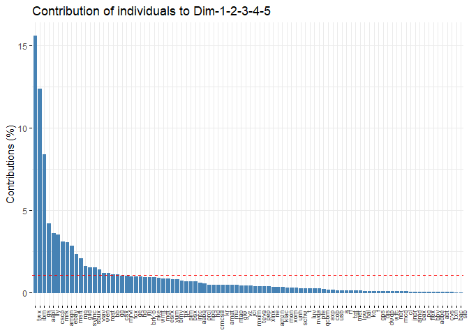

So for this project, we’re investigating the use of Principle Component
Analysis, PCA, and it’s uses in making a portfolio.

Why? To reduce the risk of a portfolio. Reducing the number of stocks in
the porfolio helps to reduce the covariance between stocks, which also
reduces the correlations between stocks. This helps to reduce the
overall risk of the portfolio.

What is PCA?
------------

Using PCA on our data
=====================

Data
----

There are 1004084 observations in our dataset. They contain all stocks
with a median daily volume of more than 3,350,000. The data is from Jan
1, 1988 until Nov 10, 2017. There are 239 stocks in the portfolio.

    glimpse(stocks)

    ## Observations: 1,004,084
    ## Variables: 8
    ## $ date     <date> 1999-11-18, 1999-11-19, 1999-11-22, 1999-11-23, 1999...
    ## $ open     <dbl> 30.713, 28.986, 27.886, 28.688, 27.083, 27.594, 27.67...
    ## $ high     <dbl> 33.754, 29.027, 29.702, 29.446, 28.309, 28.012, 28.65...
    ## $ low      <dbl> 27.002, 26.872, 27.044, 27.002, 27.002, 27.509, 27.38...
    ## $ close    <dbl> 29.702, 27.257, 29.702, 27.002, 27.717, 27.807, 28.43...
    ## $ volume   <dbl> 66277506, 16142920, 6970266, 6332082, 5132147, 183263...
    ## $ open_int <dbl> 0, 0, 0, 0, 0, 0, 0, 0, 0, 0, 0, 0, 0, 0, 0, 0, 0, 0,...
    ## $ stock    <fct> a.us, a.us, a.us, a.us, a.us, a.us, a.us, a.us, a.us,...

    summary(stocks)

    ##       date                 open                high          
    ##  Min.   :1988-01-04   Min.   :   0.0384   Min.   :   0.0579  
    ##       low               close               volume             open_int
    ##  Min.   :   0.000   Min.   :   0.0579   Min.   :0.000e+00   Min.   :0  
    ##      stock       
    ##  t.us   :  7528  
    ##  [ reached getOption("max.print") -- omitted 6 rows ]

PCA
---

PCA assumes that the data is in the form of a matrix, and it requires
there is a single stock per row. Since our data is 30 years of stock
prices with 239 stocks, we chose to perform PCA on every day and then
aggregate the results of the PCA rather than aggregating the data and
then performing PCA.

When applied to the entire dataset, it is applied to each of the 1004084
days in the dataset.

Let’s look at one of the days, 2001-06-21:

    df_models$pca_model[[400]] %>% 
      plot()

Below, are the top 10 companies that are most representative of the
companies over those 1004084 days.

    # Each stock with a value everyday 
    portfolio_pre <- df_models %>% 
      select(-pca_model) %>% 
      unnest(c(data, rankings)) %>% 
      select(-name) %>% 
      arrange(desc(value))

    portfolio_pre %>% 
      group_by(stock) %>% 
      summarize(mean_value = mean(value)) %>% 
      arrange(desc(mean_value)) %>% 
      head(10) %>% 
      left_join(tickers, by = c("stock" = "symbol")) %>% 
      select(name, mean_value) %>% 
      knitr::kable()

<table>
<thead>
<tr class="header">
<th style="text-align: left;">name</th>
<th style="text-align: right;">mean_value</th>
</tr>
</thead>
<tbody>
<tr class="odd">
<td style="text-align: left;">Alphabet Inc.</td>
<td style="text-align: right;">17.476354</td>
</tr>
<tr class="even">
<td style="text-align: left;">Goldman Sachs Group, Inc. (The)</td>
<td style="text-align: right;">6.798139</td>
</tr>
<tr class="odd">
<td style="text-align: left;">Amazon.com, Inc.</td>
<td style="text-align: right;">6.552126</td>
</tr>
<tr class="even">
<td style="text-align: left;">International Business Machines Corporation</td>
<td style="text-align: right;">5.967071</td>
</tr>
<tr class="odd">
<td style="text-align: left;">Apple Inc.</td>
<td style="text-align: right;">4.796797</td>
</tr>
<tr class="even">
<td style="text-align: left;">Tesla, Inc.</td>
<td style="text-align: right;">3.724188</td>
</tr>
<tr class="odd">
<td style="text-align: left;">NA</td>
<td style="text-align: right;">3.627641</td>
</tr>
<tr class="even">
<td style="text-align: left;">Baidu, Inc.</td>
<td style="text-align: right;">3.587910</td>
</tr>
<tr class="odd">
<td style="text-align: left;">Bank of America Corporation</td>
<td style="text-align: right;">3.268231</td>
</tr>
<tr class="even">
<td style="text-align: left;">Microsoft Corporation</td>
<td style="text-align: right;">3.130865</td>
</tr>
</tbody>
</table>

There are 73 different stocks that have appeared among each week’s top 5
stocks, between 1988-01-04 and 2017-11-10. Below are the are the PCA
values over time for each of these stocks.

    portfolio_pre %>% 
      arrange(date) %>% 
      mutate(date = floor_date(date, unit = "weeks")) %>%
      group_by(date, stock) %>% 
      summarize(value = mean(value)) %>% 
      ungroup() %>% 
      arrange(desc(value)) %>% 
      arrange(date) %>% 
      group_by(date) %>% 
      mutate(rownum = row_number(date)) %>% 
      ungroup() %>% 
      filter(rownum <= 10) %>% # Change this number to get the top X stocks on each day
      left_join(tickers, by = c("stock" = "symbol")) %>% 
      select(date, everything()) %>% 
      filter(rownum <= 5) %>% #distinct(stock) %>%  
      ggplot(aes(date, value)) + 
      geom_line(aes(color = stock))# + theme(legend.position = "none")

